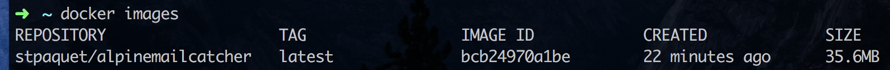

MailCatcher very small image available on docker hub thanks to Alpine Linux.

## Components & Versions
| component     | version  |
|---------------|----------|
| Alpine Linux  | 3.15     |
| MailCatcher   | 0.8      |
| Ruby          | 3.0.3-r0 |
| SQlite        | 3-1.3.13 |

Ruby & SQlite versions may differ as they are updated during the installation of the image.

## Usage

### Install it!
Run `docker pull stpaquet/alpinemailcatcher` from Terminal to install the image on your computer.

Once the installation has completed with success you can run the following command `docker images` and you should see the following output (with more or less line depending on the number of containers already installed on your computer)<br>


### Run it ...
There are different options when it comes to running this images. Here are our most favorite ones:

#### ... and delete it right away
`docker run --rm -p 1080:1080 -p 1025:1025 --name mailcatcher stpaquet/alpinemailcatcher`

#### ... as a daemon
`docker run -d -p 1080:1080 -p 1025:1025 --name mailcatcher stpaquet/alpinemailcatcher`

#### ... Changing port (& running as a daemon)
In this version you cannot change the ports being used in the image. However, you can change the port translation.
If ports 1080 or 1025 are used by an other application or service on your computer you can change these values the following way:<br>
`docker run -d -p 3080:1080 -p 3025:1025 --name mailcatcher`

### Access it!
Just point your favorite web browser to MailCatcher image IP address if on Linux or to docker-machine IP address if on a Mac or Windows PC.

##### When using Docker-Machine (Mac & Windows users)
On Mac and Windows you do not run docker directly, but through ***docker-machine***. This implies that you will not access MailCatcher web interface using the IP address of the container, but the docker-machine one.

To get the IP address of your docker-machine run the following command:
`docker-machine env dev` (assuming your docker machine is named *dev*<br>
```
export DOCKER_TLS_VERIFY="1"
export DOCKER_HOST="tcp://192.168.99.100:2376"
export DOCKER_CERT_PATH="/Users/username/.docker/machine/machines/dev"
export DOCKER_MACHINE_NAME="dev"
```
In this case, to access MailCatcher web interface you need to enter `http://192.168.99.100:1080`

###### Nota
When using ***docker-machine*** do not forget to run `eval $(docker-machine env dev)` to configure your shell. If your shell is not properly configured you will not be able to run docker commands. Thus installing or running MailCatcher using this docker image will not work.

## Ruby on Rails (Rails)
Add the following lines to your `environments/development.rb` to redirect your ActionMailer directly to MailCatcher:
```
config.action_mailer.delivery_method = :smtp
config.action_mailer.smtp_settings = { :address => '127.0.0.1', :port => 1025 }
config.action_mailer.raise_delivery_errors = false
```
Make sure that the *port* and *address* are matching the one of your MailCatcher image, or *docker-machine* if you are on a Mac or PC running Windows.

## Known "issue"
MailCatcher is running in `foreground` mode. This does not change MailCatcher behavior and performances are not affected.

## Changes
| Version | Date       | Notes                      |
|---------|------------|----------------------------|
| 1.0     | 2017-08-07 | Initial release            |
| 1.1     | 2017-08-08 |                            |
| 1.2     | 2022-0227  | Updated to Mailcatcher 0.8 |

## Wanna contribute?
Fork and pull your changes!<br>
To build run `docker build -t stpaquet/alpinemailcatcher`

## Alpine MailCatcher @DockerHub:
Our MailCatecher on Alpine can be found on our [public DockerHub](https://hub.docker.com/r/stpaquet/alpinemailcatcher/)

## Official MailCatcher sites:
Github: [https://github.com/sj26/mailcatcher](https://github.com/sj26/mailcatcher)<br>
Website: [https://mailcatcher.me/](https://mailcatcher.me/)

## Alpine Linux
Website: [https://alpinelinux.org/](https://alpinelinux.org/)
